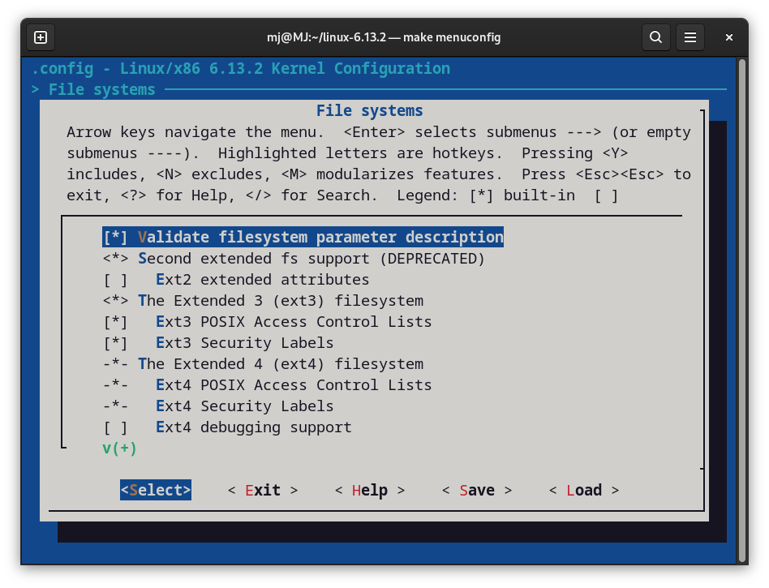
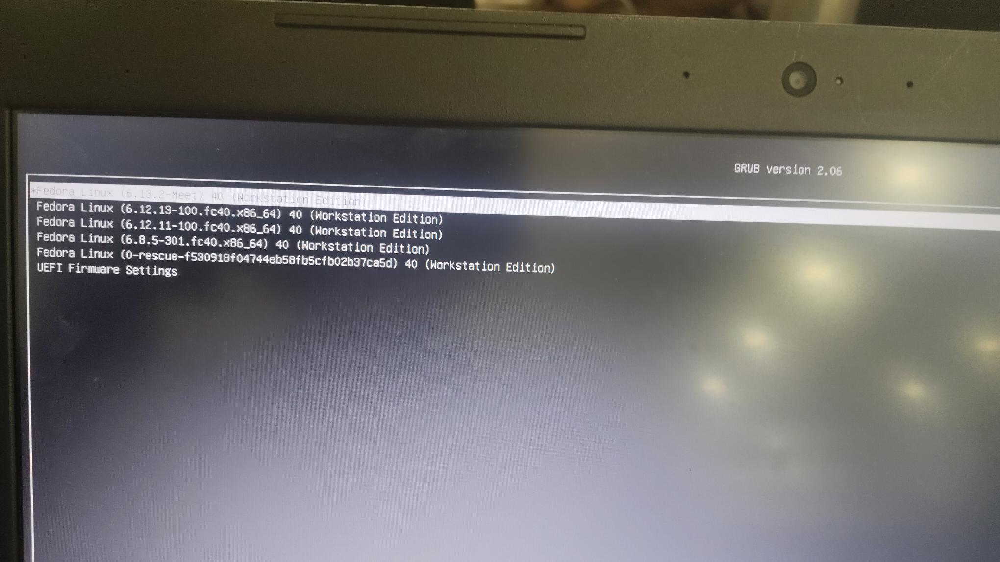
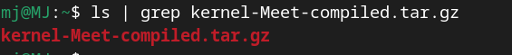

# **Linux Kernel Compilation and Installation Guide (Version 6.13.2)**

---

## **a) Download source kernel from [https://kernel.org/](https://kernel.org/) version 6.13.2**

1. Lets start with updating our system so we wont come across any unnatural issues later:  
   ```bash
   sudo dnf update && sudo dnf upgrade
   ```

2. Now lets add some of the requirements:  
   - **bc**: a basic calculator app that is used by Makefiles for calculations  
   - **bison**: a C program used so the system recognizes grammar rules, a brother to yacc (yet another c compiler)  
   - **dwarves**: to analyze kernel data and provide structure  
   - **flex**: lexical analyzer  
   - **git**: for version menu  
   - **ncurses-devel**: this is what levels `make menuconfig` run a GUI-based interface  
   - **wget**: lets us download stuff from mirror links  
   - **openssl**: signs our kernel  
   - **perl**: helps make compiler run side scripts  
   - **@development-tools**: tools needed for kernel building  

3. Use `wget` to download the `.tar` file in my PC:  
   ```bash
   wget https://cdn.kernel.org/pub/linux/kernel/v6.x/linux-6.13.2.tar.xz
   ```

4. Unzip this file using the tar library using:  
   ```bash
   tar -xvf (filename)
   ```


## **b) Activate ext3 filesystem and compile the kernel with your name as new kernel tag.**

1. Now lets create unallocated space in our PC as we would like to keep our existing file  

2. Now go into parted and check if you have free space using:  
   ```bash
   print free
   ```

3. Now see what free space you have and pick how much space you want to allocate. Based on that we run `mkpart` to create a partition:  
   ```bash
   mkpart (labelname) (filesystemlabel) (startlocation) (endlocation)
   ```

4. Get out of parted and run `lsblk` to find out the new partition name. Based on that name we can now create a filesystem.  

5. Now we use `mkfs` to make a filesystem:  
   ```bash
   mkfs.filesystemtype /dev/partitionname
   ```

6. Now we create a mount point for this filesystem at `/mountpoint` using `mkdir`.  

7. Then we use the mount command to mount it as:  
   ```bash
   mount -o (options here ro/rw) /dev/partitionname /mountpoint
   ```

8. Now to start with kernel compilation, we go into the `/linuxfolder` to start.  

9. Then we copy the default `.config` file using:  
   ```bash
   cp -v /boot/config-$(uname -r)* .config
   ```

10. We also make a few changes using:  
    ```bash
    scripts/config --disable DEBUG_INFO  
    scripts/config --set-str SYSTEM_TRUSTED_KEYS ""  
    scripts/config --set-str SYSTEM_REVOCATION_KEYS ""  
    ```

11. We use `make menuconfig` to access `menuconfig` GUI and enable ext3 filesystems.  

12. We go into the `.config` file and update it by adding our name to `CONFIG_LOCALVERSION`.  

13. Now we compile the menuconfig using:  
    ```bash
    make localmodconfig
    ```

---




---

## **c) Install the new kernel and boot laptop in new kernel**

1. Now we finally compile our kernel using:  
   ```bash
   make -j(no.of.kernels)
   ```

2. Now we install all the modules using:  
   ```bash
   make modules_install
   ```

3. Finally we install the newly created kernel using:  
   ```bash
   make install
   ```

4. Lastly, we need to update the GRUB menu such that now new kernel shows up when we open it using:  
   ```bash
   sudo grub2-mkconfig -o /boot/efi/EFI/fedora/grub.cfg
   ```

5. We reboot the system, go into the GRUB menu, and we should find our new kernel listed.  

6. We simply select the OS with that kernel and boot as normal.  

---




---

## **d) List the total number of kernel modules currently loaded in running session.**  

We simply use the `lsmod` command to find these:  
```bash
lsmod | wc -l
```

---


---

## **e) Create tar file of newly compiled directory with name `kernel-compiled.tar.gz`**  

We do this using the tar library simply:  
```bash
tar -zcvf kernel-compress.tar.gz linuxfile/
```

---




---

## **f) Show the output of `uname -r`.**  

```bash
uname -r
```

---


---

[Kernel Link](https://datasciencewiizardsai-my.sharepoint.com/:u:/g/personal/meet_jamsutkar_datasciencewizards_ai/EYiSoYzopPtIqDl6NN9IBGwBZJXZqbbuxi3_ilnPTSRamw?e=cBUy4e)

